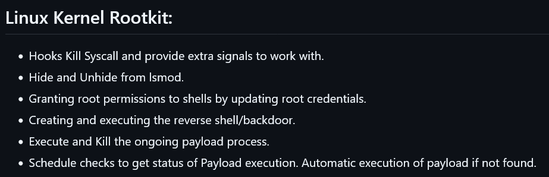

# Hi there 👋 I'm Shivom

https://shvom.pythonanywhere.com

<!--
**shv-om/shv-om** is a ✨ _special_ ✨ repository because its `README.md` (this file) appears on your GitHub profile.
- 😄 Pronouns: ...
- ⚡ Fun fact: ...
- 💬 Ask me: ...
-->

- 🔭 I’m working as a Security Analyst.
- 🌱 I’m focusing on brushing up my skills in Malware Development and Reversing.
- 👯 I’m looking to collaborate on open-source security projects.
- 📫 How to reach me: shivamch6197[at]gmail[dot]com

## 🌐 Socials:
   

# 💻 Tech Stack:
                 
# 📊 GitHub Stats:
 
 

## 🏆 GitHub Trophies

---

